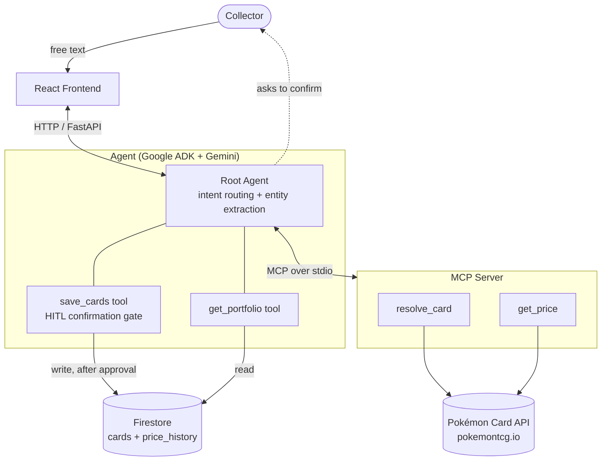

# PokéPortfolio AI

> **Catalogue your Pokémon card collection by just *describing* it — in plain language.**
> No forms, no dropdowns, no scanning card-by-card. Type *"2 Charizard ex 151 NM, 1 Mewtwo GX PSA 9"* and an AI agent does the rest.

PokéPortfolio AI is a **Concierge agent** that turns messy, free-form text into a clean, priced, and organized card collection. It understands what you own, resolves each card against a canonical catalogue, fetches its market value, asks you to confirm, and saves it to your private portfolio.

*Built for the Kaggle × Google "5-Day AI Agents" Capstone — Track: **Concierge Agents**.*

---

## The problem

Every Pokémon collector-tracking app today (Collectr, Pokécardex, and friends) makes you catalogue cards **one at a time**, through search boxes, filters, and scanners. That is painful the moment reality gets messy:

- You have a **box of 200 cards** to log.
- You're copying from a **WhatsApp screenshot** or a seller's list.
- The card is **old, foreign-language, or graded**, and the search filters fight you.

The result is friction — so most collections never actually get catalogued.

## The solution

**Describe your cards the way you'd tell a friend, and let an agent handle the tedium.**

PokéPortfolio AI reads natural language, extracts each card and its attributes (quantity, set, condition, language, grading), resolves ambiguity by *asking* instead of guessing, prices everything, and — only after you approve — saves it. The differentiator is the **natural-language intake**: the collector's effort drops from dozens of clicks per card to a single sentence for a whole batch.

### What it does

- 🗣️ **Natural-language intake** — "2 Charizard ex 151 NM, 1 Pikachu promo JP" becomes structured, priced records.
- 🧩 **Smart resolution** — matches each description to a canonical card; when several cards fit, it **asks which one** rather than guessing.
- 💵 **Real market pricing** — pulls current prices from a card-price API through a dedicated MCP server (no hallucinated numbers).
- ✅ **Confirm-before-save (human-in-the-loop)** — nothing is ever written to your collection without your explicit approval.
- 📊 **Live portfolio** — see your whole collection and its total value at a glance.
- 🔒 **Private by design** — single-user, your data in your own database, no secrets in code.

---

## Architecture

PokéPortfolio AI is a single **ADK (Agent Development Kit)** agent whose "intent router" is the LLM itself: it decides which tool to call. External card lookups are isolated behind an **MCP server**, and all persistence goes through a single Firestore layer.



### Layers

1. **Frontend (React)** — free-text input and a portfolio view with total live value.
2. **Agent (ADK + Gemini)** — the orchestrator. Extracts entities from text, routes intent, runs the add flow, and enforces the confirmation step. Ships two first-party tools: `save_cards` (write) and `get_portfolio` (read).
3. **MCP Server** — exposes `resolve_card(name, set, number)` and `get_price(card_id)` to the agent over stdio. Isolating card lookups behind MCP keeps the external API swappable and prevents the model from inventing prices.
4. **Persistence (Firestore)** — the *only* layer that touches the database. Two collections: `cards` (your collection) and `price_history` (time series for value tracking).
5. **Deployment** — packaged for **Google Cloud Run** via the Agents CLI.

### The "Add" flow (step by step)

1. You send free text → the agent **extracts** each card and its attributes.
2. For each item, the agent calls **`resolve_card`** (MCP) to find candidates.
3. **Ambiguity first:** if more than one card fits, the agent **asks you** which one. If none fit, it offers a manual entry.
4. Once everything is resolved, it calls **`get_price`** and presents the **whole batch** (cards, details, prices, total).
5. **You confirm.** Only then does the agent call **`save_cards`**.
6. Your portfolio updates with the new cards and total value.

**Security note:** `save_cards` is guarded by ADK's native **human-in-the-loop confirmation** (`require_confirmation`). The runtime pauses the tool call and requires a genuine approval that the model **cannot fabricate** — so a write can never happen without a real human "yes".

---

## Course concepts demonstrated

| Concept | Where it lives |
| --- | --- |
| **Agent / ADK** | `app/agent.py` — root `LlmAgent` with intent routing and entity extraction. |
| **MCP Server** | `mcp_server/` — `resolve_card` + `get_price` exposed over stdio, consumed by the agent as an MCP client. |
| **Security** | Human-in-the-loop confirmation gate on writes; all secrets in environment variables, never in code. |
| **Deployability** | Container + manifest for **Cloud Run**, deployed via the Agents CLI. |
| **Agent skills / Agents CLI** | Project scaffolded, run, and deployed with `agents-cli`. |

---

## Tech stack

- **Python 3.11+** managed with **`uv`**
- **Google ADK** with **Gemini** (`gemini-flash-latest`)
- **MCP** (FastMCP / `mcp` SDK) for the tool server
- **`httpx`** for the card-price API client (with retry + backoff)
- **Firestore** (Native mode) via `google-cloud-firestore`
- **FastAPI** (via ADK) to serve the agent
- **React + TypeScript + Vite** frontend
- **Ruff** for lint/format

## Project structure

```
pokeportfolio-ai/
├── app/                 # ADK agent
│   ├── agent.py         # root agent + tool wiring (MCP toolset + first-party tools)
│   ├── tools.py         # save_cards (HITL gate), get_portfolio
│   └── prompts.py       # system instruction (add flow, ambiguity, confirmation)
├── mcp_server/          # MCP server
│   ├── server.py        # resolve_card, get_price (FastMCP)
│   └── card_api.py      # async httpx client for the card-price API
├── persistence/         # data layer
│   └── firestore_repo.py# the only module that reads/writes Firestore
├── models/              # Pydantic data contracts (Card, Candidate, Price, ...)
├── frontend/            # React + Vite UI
├── scripts/             # smoke tests (card API, Firestore)
├── .env.example         # variable names only (no values)
└── README.md
```

---

## Setup & run locally

> **Status:** the core *Add* flow (natural-language intake → resolve → confirm → save → portfolio) runs end-to-end locally today. The React frontend and continuous live-price refresh are on the roadmap below.

### Prerequisites

- Python 3.11+ and [`uv`](https://docs.astral.sh/uv/)
- A Google Cloud project with **Firestore (Native mode)** enabled
- A free API key from [pokemontcg.io](https://dev.pokemontcg.io/)
- `gcloud` CLI, authenticated with Application Default Credentials (for Firestore access)

### 1. Clone and install

```bash
git clone https://github.com/<your-username>/pokeportfolio-ai.git
cd pokeportfolio-ai
uv sync
```

### 2. Configure environment

Copy the example file and fill in your own values (this file is git-ignored — **never commit real keys**):

```bash
cp .env.example .env
```

| Variable | Purpose |
| --- | --- |
| `GEMINI_API_KEY` | Gemini API key for the agent (ADK may also read `GOOGLE_API_KEY` — set both to the same value if needed). |
| `GOOGLE_CLOUD_PROJECT` | Your GCP project ID (hosts Firestore). |
| `CARD_API_KEY` | Your pokemontcg.io API key. |
| `CARD_API_BASE_URL` | `https://api.pokemontcg.io/v2` |
| `GOOGLE_APPLICATION_CREDENTIALS` | Path to ADC credentials — needed for deployment only. |

### 3. Authenticate to Google Cloud (for Firestore)

```bash
gcloud auth application-default login
gcloud config set project <your-project-id>
```

### 4. Run the agent

```bash
uv run adk run app
```

Then type a request, e.g. `add 1 Charizard Legendary Collection 3 NM`, and follow the agent's prompts (it will resolve the card, show the price, and ask you to confirm before saving).

### Smoke tests

```bash
uv run python scripts/smoke_test_card_api.py    # card-price API
uv run python scripts/smoke_test_firestore.py   # Firestore round-trip (creates + cleans up a test doc)
```

### Deploy (Cloud Run)

The agent is packaged for Google Cloud Run and deployed via the Agents CLI:

```bash
agents-cli deploy
```

> _Live demo URL: to be added after deployment._

---

## Roadmap

- **Query & manage** — ask questions ("how many Charizards do I have?", "what's my total worth?") and remove/edit cards, all with the same confirmation safety.
- **Live price refresh** — re-fetch current prices whenever the portfolio is opened, plus a daily job feeding `price_history`.
- **Interactive dashboard** — charts of value over time.
- **Photo intake** — snap a card and let Gemini's multimodal model read it.
- **Marketplace / social layer** — connect collectors.

---

## Security

- 🔑 **No secrets in code or git.** All keys live in environment variables; `.env` is git-ignored and `.env.example` ships only variable *names*.
- ✅ **Human-in-the-loop writes.** Saving is gated by ADK's native confirmation — the model cannot write without a real user approval.
- 🔒 **Private, single-user data** stored in your own Firestore project.

## License

Licensed under [Creative Commons Attribution 4.0 International (CC BY 4.0)](https://creativecommons.org/licenses/by/4.0/) — see [`LICENSE`](./LICENSE). © 2026 Ilan Schapira.
